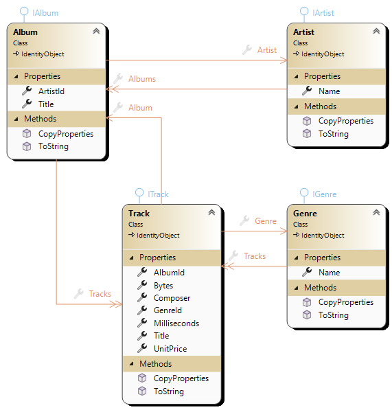

# MusicStore

------

**Lernziele**

- Diese Vorlage dient als Ausgangspunkt für verschiedenste Aufgaben.

## MusicStore

Das Projekt **'MusicStore'** ist ein kleines datenzentriertes Anwendungsbeispiel mit welchem die Erstellung eines Software-Systems dargestellt werden soll. Aufgrund der Komplexität, die ein Software-System im Allgemeinem darstellt, ist die Erstellung des Beispiels in mehreren Themenbereichen unterteilt. Jedes Thema beginnt mit dieser Vorlage und wird entsprechend der jeweiligen Aufgabenstellung erweitert. 

### Vorlage

In dieser Vorlage gibt es bereits zwei unterschliedliche Projekte:

|Name|Beschreibung|
|---|---|
|MusicStore.ConApp| Eine Konsolen-Anwendung zum Starten der Anwendung und Ausführung des Programm-Menüs. Die entsprechenden Menü-Funktionen müssen implementiert werden und sind mit *throw new NotImplementedException()* markiert. |
|MusicStore.Logic| In diesem Projekt sind alle Schnittstellen und der Datenzugriff definiert. |
|MusicStore.Logic.Contracts| In diesem Abschnitt befinden sich alle Schnittstellen. |
|MusicStore.Logic.DataContext| In diesem Abschnitt befindet sich der Data-Kontext (`MusicStroeContext`). |

### Datenstruktur

Die Datenstruktur vom 'MusicStore' ist einfach und besteht im wesentlichen aus 4 Komponenten welche in der folgenden Tabelle zusammengefasst sind:

|Komponente|Beschreibung|Grösse|Mussfeld|Eindeutig|
|---|---|---|---|---|
|**Artist**|Der Artist interpretiert und komponiert unterschiedlichste Musik-Titeln. Diese werden in einer oder mehreren Sammlung(en) (Album) zusammengefasst.|
|*Name*|Name und des Artisten|1024|Ja|Ja|
|**Album**|Das Album beinhaltet eine Sammlung von Musik-Titeln (Track) und ist einem Artisten zugeortnet.|||
|*Title*|Titel des Albums|1024|Ja|Ja|
|*ArtistId*|Fremdschüssel zum Artisten|int|Ja|Nein|
|**Genre**|Das Genre definiert eine Musikrichtung und dient zur Klassifikation. Diese Information muss einem Musiktitel (Track) zugeordnet sein.|||
|*Name*|Name vom Genre|256|Ja|Ja|
|**Track**|Der Track definiert einen Musik-Titel und ist einem Album zugeordnet. Über das Album kann der Artist ermittelt werden.|||
|*Title*|Titel des Musikstückes|1024|Ja|Nein|
|*Composer*|Komponist des Musikstückes|512|Nein|Nein|
|*Bytes*|Größe, in Bytes, des Titles|long|Ja|Nein|
|*Milliseconds*|Zeit des Titles|long|Ja|Nein|
|*UnitPrice*|Kosten des Titles|double|Ja|Nein|
|*GenreId*|Fremdschüssel zum Genre|int|Ja|Nein|
|*AlbumId*|Fremdschüssel zum Album|int|Ja|Nein|
|**Hinweis**|Alle Komponenten haben eine eindeutige Identität (Id)||||
|*|*Natürlich können noch weitere Attribute hinzugefügt werden.*||||

Aus dieser Definition kann ein entsprechendes Objektmodell abgeleitet werden, welches nachfolgend skizziert ist:

### Testen des Systems

Überprüfen Sie die Daten mit Excel oder einem beliebigem Text-Editor!

## Hilfsmitteln

- keine Angaben

## Abgabe

- Termin: 1 Woche nach der Ausgabe

- Klasse:

- Name:

## Quellen

- keine Angabe

> **Viel Erfolg!**
"# MusicStoreDB" 
"# MusicStoreDB" 
